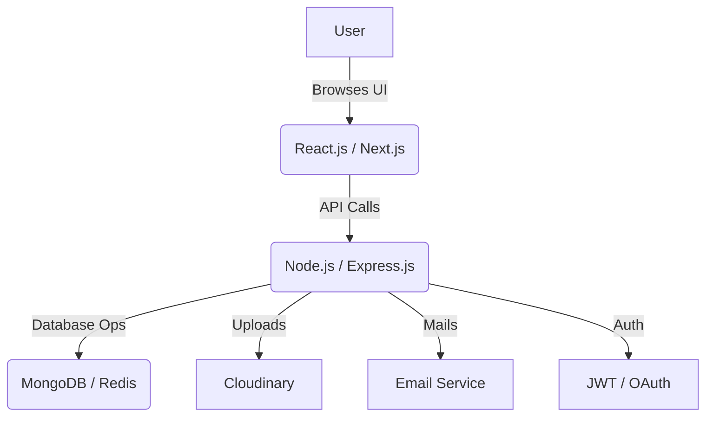

<!-- Profile Banner -->
<p align="center">
  
</p>

<p align="center">
  <a href="mailto:your.email@example.com">
    
  </a>
  <a href="https://linkedin.com/in/your-linkedin">
    
  </a>
  
</p>

---

## 🚀 About Me

```yaml
title: JavaScript All-Rounder | Senior Full-stack Developer
```
Hi! I'm <b>Robin</b>, a passionate developer who loves building modern, scalable, and secure web applications using JavaScript and its powerful ecosystem. I specialize in both frontend and backend, creating seamless digital experiences from pixel-perfect UI to robust APIs.

---

## 🛠️ Tech Stack

<p align="center">
  
</p>

- **Frontend:** React.js, Next.js, Tailwind CSS, Bootstrap, Responsive UI/UX
- **Backend:** Node.js, Express.js, TypeScript, REST API, JWT, OAuth, RBAC
- **Database:** MongoDB, Redis, Mongoose
- **Other:** Cloudinary, Docker, CI/CD, Email Services, Git & GitHub

---

## ✨ What I Do

- **Frontend Magic:** Build beautiful, fast, and interactive UIs with React, Next.js, and Tailwind CSS.
- **Backend Engineering:** Design secure, scalable APIs and microservices with Node.js/Express.
- **Authentication & Security:** Implement complex auth flows (JWT, OAuth, multi-provider, OTP).
- **DevOps & Integrations:** Cloudinary uploads, Redis caching, Docker, and cloud deployments.
- **Open Source:** Active in contributing and collaborating within the JavaScript community.

---

## 🏆 Highlights

- 🚀 Full-stack apps from scratch (React/Next.js + Node.js/Express)
- 🔐 Production-level authentication systems (see my [AuthService](#))
- 🌐 Google OAuth, Cloudinary, Redis integrations
- 🧹 Clean, maintainable code with best practices

---

## 📈 GitHub Stats

<p align="center">
  
  
</p>

---

## 📊 Workflow Overview



---

## 📫 Let's Connect

<p align="center">
  <a href="mailto:your.email@example.com">
    
  </a>
  <a href="https://linkedin.com/in/your-linkedin">
    
  </a>
</p>

---

## 📝 Recent Projects

- **Advanced AuthService**  
  Full-stack authentication system with multi-provider support, session management, and robust security.
- **Modern React/Next.js UIs**  
  Responsive, accessible, and fast UIs with Tailwind CSS and advanced React patterns.
- **API Backends**  
  RESTful APIs for e-commerce, SaaS, and more.
- **Open Source Contributions**  
  Active contributor to JavaScript/TypeScript projects.

---

## 💡 Fun Fact

> <b>“JavaScript everywhere: from backend to frontend, API to UI, and everything in between!”</b>

---

<p align="center">
  
</p>
